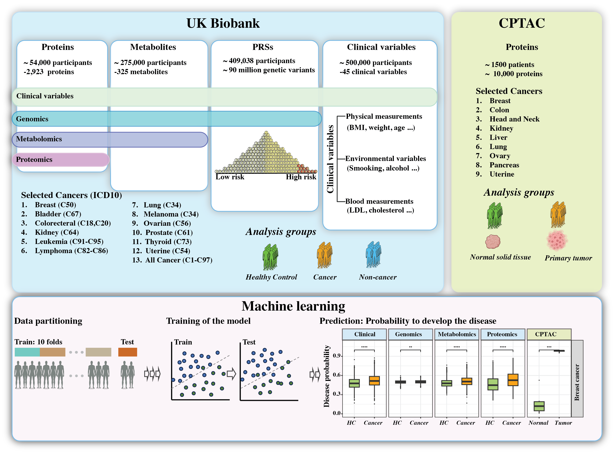

# Multiomics biomarkers were not superior to clinical variables for pan-cancer screening

**S**wedish **D**igital **T**win **C**onsortium - **C**enter for **P**ersonalized **M**edicine

## General information

This is a github page dedicated to a manuscript TODO:link. The aim of the manuscript was to create an interactive multiomic atlas for complex diseases (available at https://macd.shinyapps.io/CancerAtlas/) and compare the predictive and diagnostic potential of different omics

## Overview

**Overview figure of the study.** Figure 1. Overview of the study We analyzed proteomes, metabolomes, genetic variants in peripheral blood, and clinical variables from cancer patients and their matched healthy controls from the UK Biobank, as well as local tumor proteomes from the Clinical Proteomic Tumor Analysis Consortium (CPTAC). Using these data, we trained prediction models to diagnose cancer patients, which were evaluated on the hold-out test dataset.

## Accsess to the data

Raw data from the UK Biobank are available for approved researchers through the UK Biobank data-access protocol. 

## Guide for the code

The code is divided into 3 main parts based on the coding language. The data are firstly processed using the *Decodes2convert_UKBB_file.sh* and *Decode_UKBBdata_ICD9and10.py*. The proteomics and metabolomics data are further processed using the R script *UKBB_proteomics_dataPre_processing.py* and *Metabolomics_secondPhase_dataPreprocessing.R* respectively, while genomics data are processed using *PRS_construction.sh*. The next step is to select the patients for different disease and their age/sex matched healthy controls using the *Patient_selection.R* script. The output of this file is directly used in the python files *cancer_diagnistics...* where the prediction pipeline (imputation, feature selection, training of the model) is run. The final results in the manuscript are created using *figures.R* file, and there is a specific folder that can be used to recreate the shiny application. 

